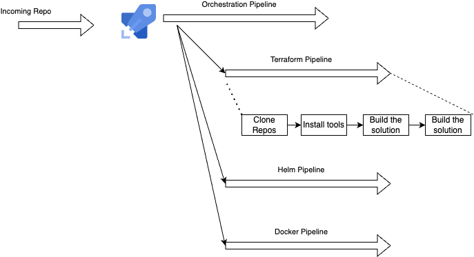

# Infrastructure as Code Pipeline

This Azure DevOps pipeline orchestrates the build, deployment, and infrastructure management process using Docker, Helm, and Terraform.

Pipeline accepts a target repository as input.

## Overview

This pipeline automates the following processes:
1. Building Docker images
2. Pushing images to a container registry
3. Deploying applications using Helm charts
4. Managing infrastructure with Terraform

## Prerequisites

- Azure DevOps account
- Azure subscription
- Docker
- Helm
- Terraform backend configured (e.g., Azure Storage Account)

## Pipeline Structure

The pipeline is divided into several stages:

1. **Build**: Pipeline decides what pipeline to trigger.

## Configuration

Pass an techonology argument through a Library definition.

## Usage

1. Fork this repository
2. Set up the necessary service connections in your Azure DevOps project
3. Update the pipeline variables in `azure-pipelines.yml`
4. Run the pipeline
